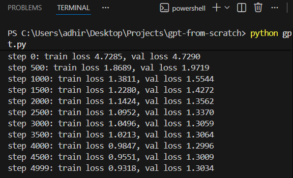

# Plato-GPT 🏛️

A decoder-only Transformer model trained from scratch on the philosophical works of Plato. This project implements a Generative Pre-trained Transformer (GPT) using PyTorch and CUDA, capable of generating original philosophical text in the style of the ancient Greek philosopher.
Optimized hyperparameters to achieve a cross-entropy loss of 1.30 on the validation set after 5,000 training iterations.

## 🧠 Project Overview

This model is a character-level language model based on the architecture described in the paper *"Attention Is All You Need"* (Vaswani et al., 2017). It was built to understand the fundamentals of Large Language Models (LLMs), specifically:
* **Multi-Head Self-Attention** mechanism
* **Feed-Forward Networks**
* **Positional Embeddings** & **Residual Connections**
* **Training on Custom Datasets**

### 📈 Training Performance
*Validation loss dropping to 1.3034 over 5000 steps:*



* `gpt.py`: The main script containing the Transformer architecture class, training loop, and hyperparameter configuration.
* `sample.py`: An inference script that loads the saved model weights (`plato_gpt_model.pth`) and generates new text.
* `input.txt`: The training dataset (The Republic by Plato).

## 🚀 How to Run

### Prerequisites
Ensure you have Python and the CUDA-enabled version of PyTorch installed:
```bash
pip install torch torchvision torchaudio --index-url [https://download.pytorch.org/whl/cu118](https://download.pytorch.org/whl/cu118)
```
To train the GPT model from scratch on the dataset (Plato's Republic):
```bash
python gpt.py
```
Once the model is trained and the .pth file is saved, you can generate new text without retraining:
```bash
python sample.py
```
